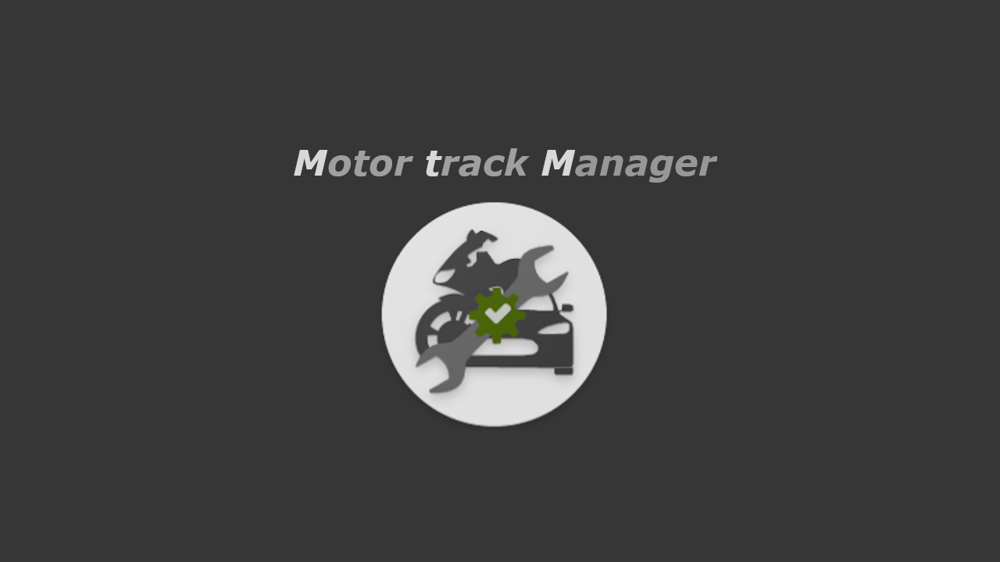
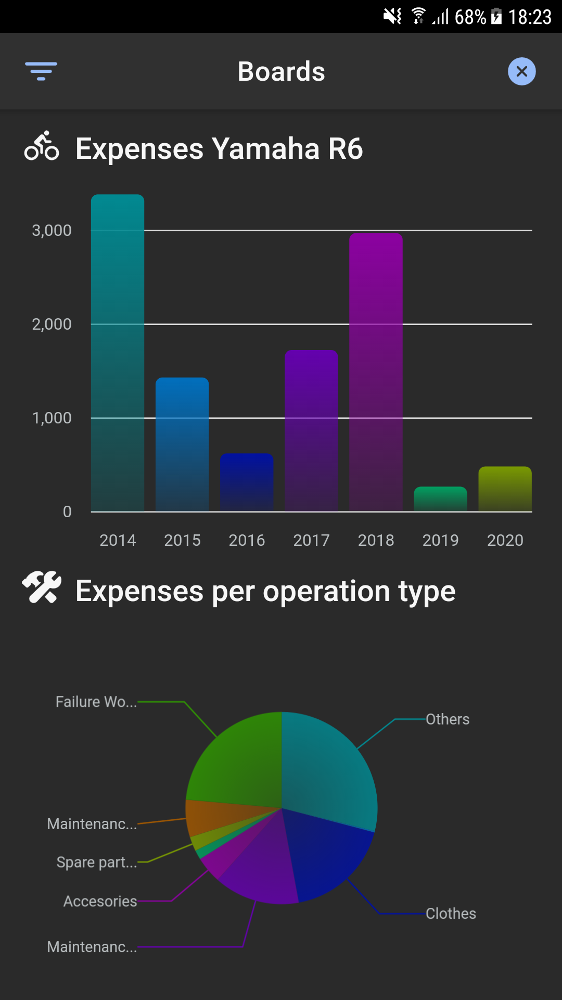
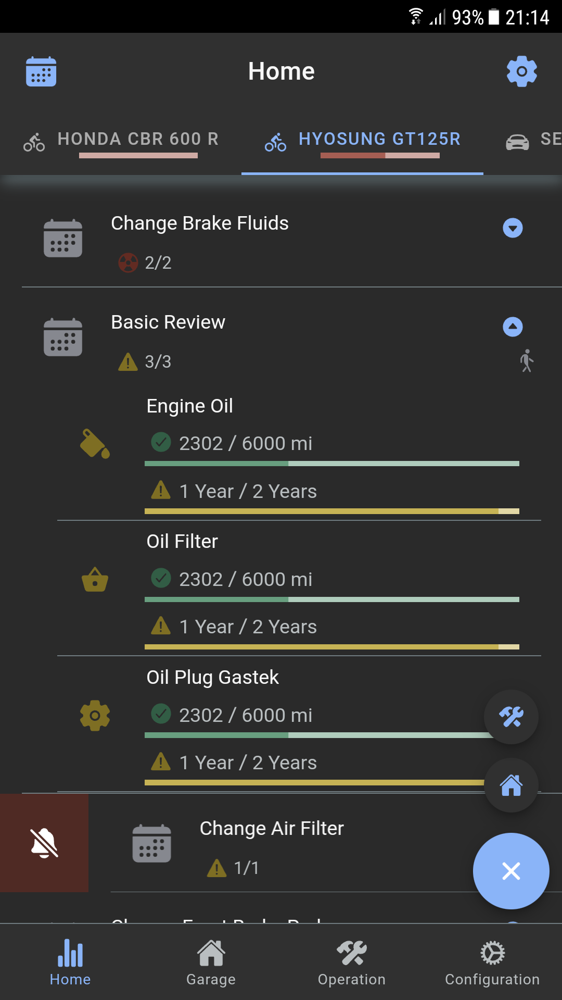
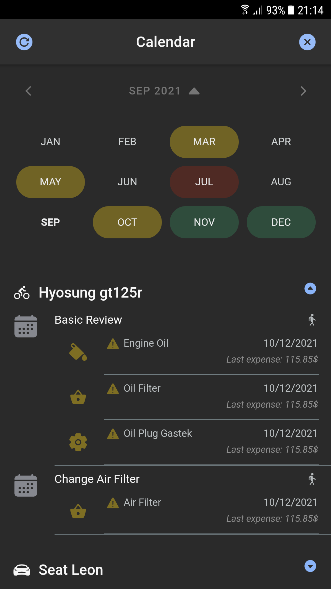

# Motor Track Manager - MtM
Application to manage the maintenance of personal vehicles without having to remember when a review was made and how much is left for the next oil change of your motorcycle or car.

It helps you to know at any time when you should pass the next review and the life of your vehicle parts by configuring each maintenance in a personalized way.

## Tutorial:
   1. "Vehicles" tab: Add your vehicles.
   2. "Operations" tab: Add the reviews, purchases, etc. made to your vehicles.
                  * Important: You must indicate the replaced parts for the notifications to be 
                                         calculated correctly.
   3. "Home" tab: You can now see the notifications of the life of the parts of your vehicles.
   4. "Configuration" tab: Customize vehicle maintenance by creating specific configurations for each vehicle.

* NOTE: This application does NOT share data on the network. The data of your vehicles and maintenance that you add to the application will be only on your device and if the application is deleted the data will be lost. Although it has a procedure for exporting and importing data.

## Technologies
Proyect is created with:
* Visual Code
* HTML5, SCSS3 y Typescript 4.5
* Angular 13
* Jasmine and Karma
* Ionic 6
* Cordova
* SQLite
* SonarQube

## Application

<table>
  <tr>
    <td>Splasscreen</td>
  </tr>
  <tr>
    <td></td>
  </tr>
 </table>

<table>
  <tr>
    <td>Board</td>
    <td>Home</td>
    <td>Calendar</td>
  </tr>
  <tr>
    <td></td>
    <td></td>
    <td></td>
  </tr>
 </table>